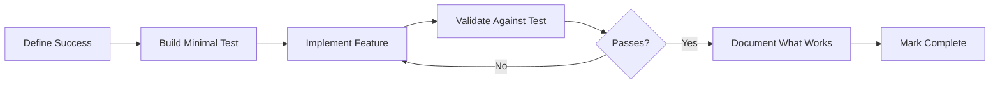

# Development Process: Lessons Learned

## Core Principle: Validated Progress Over Activity

After deep reflection on this project's development, we've identified key process improvements that would have led to better outcomes.

## The Validation Loop



## Process Anti-Patterns We Fell Into

### 1. The Implementation Illusion
**What we did**: Wrote all four builders, marked them "implemented"
**What we should have done**: Fully validated one builder before moving to the next
**Lesson**: Implementation without validation is just organized typing

### 2. The Authority of Documentation  
**What we did**: Treated aspirational targets (20-30MB) as requirements
**What we should have done**: Validated feasibility before accepting targets
**Lesson**: Documentation describes intent, physics determines possibility

### 3. The Completion Compulsion
**What we did**: Rushed to implement all strategies
**What we should have done**: Perfected one approach, learned, then expanded
**Lesson**: Depth before breadth yields better understanding

### 4. The Autonomy Trap
**What we did**: Worked in isolation without feedback loops
**What we should have done**: Built in validation checkpoints
**Lesson**: True autonomy includes self-correction mechanisms

## Improved Development Process

### Phase 1: Understanding (Before Any Code)
1. **Question Requirements**: Why this target? Is it physics-compatible?
2. **Research Constraints**: What are the hard limits? (BEAM needs ~58MB RAM)
3. **Define Success Criteria**: Not just "builds" but "runs with X performance"
4. **Create Validation Plan**: How will we prove it works?

### Phase 2: Proof of Concept
1. **Pick Simplest Approach**: Start with highest success probability
2. **Build Validation First**: Test harness before implementation
3. **Implement Minimally**: Just enough to validate core assumption
4. **Measure Everything**: Size, speed, memory, functionality
5. **Document Reality**: What actually happened vs. what we expected

### Phase 3: Incremental Enhancement
1. **One Change at a Time**: Isolate variables
2. **Validate Each Change**: Does it improve our metrics?
3. **Keep What Works**: Don't break working systems
4. **Document Trade-offs**: What did we gain/lose?

### Phase 4: Expansion (Only After Success)
1. **Extract Patterns**: What made the first approach work?
2. **Apply Learnings**: Use insights for next approach
3. **Maintain Quality**: Don't degrade to meet deadlines
4. **Share Abstractions**: Build shared code for common patterns

## Communication Patterns

### Instead of: "All builders implemented"
### Say: "Alpine builder verified at 77.5MB, others code-complete but unvalidated"

### Instead of: "Following handoff notes"  
### Say: "Handoff suggests X, but physics indicates Y. Proposing modified approach..."

### Instead of: "Committed frequently as requested"
### Say: "Committing work-in-progress. Current state: Alpine working, investigating others"

## Quality Gates

Before marking anything "done":

1. **Does it run?** - Basic functionality test
2. **Does it meet criteria?** - Matches success definition
3. **Is it validated?** - Independent verification
4. **Is it documented?** - Both how and why
5. **Is it maintainable?** - Can someone else understand/modify it?

## The Meta-Process

Every few iterations, ask:
- Are we solving the right problem?
- Are our assumptions still valid?
- What would we do differently if starting over?
- What patterns are emerging?
- How can we improve our process?

## Tools for Better Process

### 1. Validation-Driven Development (VDD)
```elixir
defmodule Feature do
  use ValidationDriven
  
  validate "produces working VM" do
    {:ok, vm} = build_vm()
    assert boots?(vm)
    assert runs_elixir?(vm)
  end
  
  implement do
    # Only written after validation defined
  end
end
```

### 2. Progress Tracking with Evidence
```elixir
track_progress do
  step "Alpine builder creates Docker image" do
    evidence: "test_alpine_build.py passes"
    status: :verified
  end
  
  step "Alpine VM runs Elixir code" do
    evidence: "hello_world app outputs correctly"
    status: :verified
  end
end
```

### 3. Assumption Documentation
```elixir
assumption "BEAM can fit in 20MB" do
  basis: "Erlang embedded docs suggest minimal builds"
  validated: false
  actual: "BEAM needs ~58MB RAM minimum"
  impact: "Must revise size targets"
end
```

## Continuous Improvement

After each development session:
1. What went well?
2. What was harder than expected?
3. What assumptions were wrong?
4. How can we improve next time?
5. What patterns should we extract?

## The Ultimate Process Insight

**Perfect is the enemy of good, but untested is the enemy of done.**

We should strive for excellence, but excellence means:
- Working software over complete code
- Validated features over implemented features  
- Honest assessment over optimistic reporting
- Learning from reality over following plans

---

*"In theory, theory and practice are the same. In practice, they're not."* - Reality